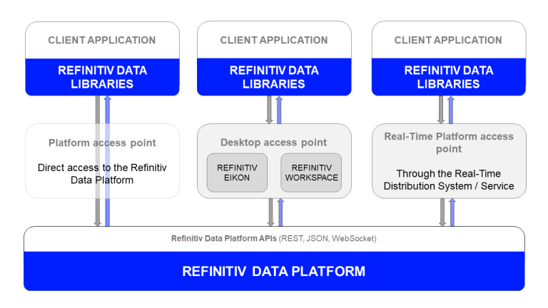

# How to integrate Financial Data from Data Library to Excel with Xlwings
- version: 1.0
- Last update: November 2023
- Environment: Windows
- Prerequisite: [Access to RDP credentials](#prerequisite) and [xlwings](https://www.xlwings.org)

Example Code Disclaimer:
ALL EXAMPLE CODE IS PROVIDED ON AN “AS IS” AND “AS AVAILABLE” BASIS FOR ILLUSTRATIVE PURPOSES ONLY. REFINITIV MAKES NO REPRESENTATIONS OR WARRANTIES OF ANY KIND, EXPRESS OR IMPLIED, AS TO THE OPERATION OF THE EXAMPLE CODE, OR THE INFORMATION, CONTENT, OR MATERIALS USED IN CONNECTION WITH THE EXAMPLE CODE. YOU EXPRESSLY AGREE THAT YOUR USE OF THE EXAMPLE CODE IS AT YOUR SOLE RISK.

## Overview

With the rise of Data Scientist, Financial coder or, Trader (aka Citizen Developers) and rapid growth of [Jupyter](https://jupyter.org/) application, the main target of every Citizen Developers are replacing [Microsoft Excel](https://www.microsoft.com/en-us/microsoft-365/excel) with Jupyter application (reference: [Jupyter is the new Excel](https://towardsdatascience.com/jupyter-is-the-new-excel-a7a22f2fc13a)). 

However, Excel is not obsolete and still be an important file format/application in the business. It is easy to distribute and non-IT people (especially your boss) can open it easily than setup Jupyter/Python environment. 

This example project contains a series of Jupyter Notebook and Python console applications that demonstrate how to export financial data and report from Python/Jupyter application to Excel report file using xlwings CE and xlwings PRO libraries. The demo application uses content from [Refinitiv Data Platform (RDP)](https://developers.refinitiv.com/en/api-catalog/refinitiv-data-platform/refinitiv-data-platform-apis) via the ease-of-use [Data Library for Python](https://developers.lseg.com/en/api-catalog/refinitiv-data-platform/refinitiv-data-library-for-python) as an example of data set.

## Introduction to xlwings

[xlwings](https://www.xlwings.org) is a Python library that makes it easy to call Python from Excel and vice versa on Windows and macOS. The library lets you automate Excel from Python source code to produce reports or to interact with Jupyter notebook applications. It also allows you to replace VBA macros with Python Code or write UDFs (user defined functions - Windows only).
* The [xlwings CE](https://docs.xlwings.org/en/stable) is a free and open-source library ([BSD-licensed](https://opensource.org/licenses/BSD-3-Clause)) which provides basic functionalities to lets developers integrate Python with Excel. 
* The [xlwings PRO](https://www.xlwings.org/pricing) provides more advance features such as [reports](https://www.xlwings.org/reporting), embedded Python code in Excel, one-click installers for easy deployment, video training, dedicated support and much more. 

Please refer to [Financial Reporting with Workspace, xlwings and Excel](https://developers.lseg.com/en/article-catalog/article/financial-reporting-with-eikon-and-excel) article which give detail regarding how to integrate xlwings with other LSEG Python API.

*Note*:
This project is based on xlwings versions **0.30.12**.

## Introduction to the Data Library for Python

The Refinitiv Data Library for Python provides a set of ease-of-use interfaces offering coders uniform access to the breadth and depth of financial data and services available on the Refinitiv Data Platform. The API is designed to provide consistent access through multiple access channels and target both Professional Developers and Financial Coders. Developers can choose to access content from the desktop, through their deployed streaming services, or directly to the cloud. With the Refinitiv Data Library, the same Python code can be used to retrieve data regardless of which access point you choose to connect to the platform.

 

The RDP Library are available in the following programming languages:
- [Python](https://developers.lseg.com/en/api-catalog/refinitiv-data-platform/refinitiv-data-library-for-python)
- [TypeScript/JavaScript](https://developers.lseg.com/en/api-catalog/refinitiv-data-platform/refinitiv-data-library-for-typescript)
- [.NET](https://developers.lseg.com/en/api-catalog/refinitiv-data-platform/refinitiv-data-library-for--net)

For more deep detail regarding the RDP Libraries, please refer to the following articles and tutorials:
- [Quickstart](https://developers.lseg.com/en/api-catalog/refinitiv-data-platform/refinitiv-data-library-for-python/quick-start).
- [Documentation](https://developers.lseg.com/en/api-catalog/refinitiv-data-platform/refinitiv-data-library-for-python/documentation).
- [Tutorials](https://developers.lseg.com/en/api-catalog/refinitiv-data-platform/refinitiv-data-library-for-python/tutorials).
- [GitHub](https://github.com/LSEG-API-Samples/Example.DataLibrary.Python).

### Disclaimer

This project is based on RD Library Python versions **1.5.0** using the Desktop Session only.

## Prerequisite
This demo project requires the following dependencies software.
1. Workspace access credential.
2. [xlwings library](https://www.xlwings.org/) version 0.30.x and above.
3. [Microsoft Excel](https://www.microsoft.com/en-us/microsoft-365/excel).
4. Python [Anaconda](https://www.anaconda.com/distribution/) or [MiniConda](https://docs.conda.io/en/latest/miniconda.html) distribution/package manager.
5. [Jupyter Lab](https://jupyter.org/).
6. Internet connection.

Please contact your Refinitiv's representative to help you to access Refinitiv Workspace credentials. You can generate/manage the AppKey by follow the steps on "Desktop - Eikon or Refinitiv Workspace" section of [RD Library - Python Quickstart page](https://developers.lseg.com/en/api-catalog/refinitiv-data-platform/refinitiv-data-library-for-python/quick-start).

[todo]

<!-- ACKNOWLEDGEMENTS -->
## Acknowledgements

Thank you [Felix Zumstein (@fzumstein)](https://github.com/fzumstein) from [xlwings](https://www.xlwings.org/) for your contribution, code and content review and your support.

## References

You can find more details regarding the Data Library for Python, xlwings and, related technologies for this notebook from the following resources:
* [Data Library for Python](https://developers.lseg.com/en/api-catalog/refinitiv-data-platform/refinitiv-data-library-for-python) on the [LSEG Developer Community](https://developers.lseg.com/) web site.
* [Xlwings web site](https://www.xlwings.org/).
* [Xlwings CE Document page](https://docs.xlwings.org/en/stable/).
* [xlwings Pro page](https://www.xlwings.org/pricing).
* [xlwings API Reference page](https://docs.xlwings.org/en/latest/api).
* [xlwings Reports page](https://www.xlwings.org/reporting).
* [xlwings Embedded Code page](https://docs.xlwings.org/en/stable/deployment.html#embedded-code).
* [Financial Reporting with Eikon, xlwings and Excel](https://developers.lseg.com/en/article-catalog/article/financial-reporting-with-eikon-and-excel).

For any questions related to this article or Data Library, please use the Developers Community [Q&A Forum](https://community.developers.refinitiv.com/).
