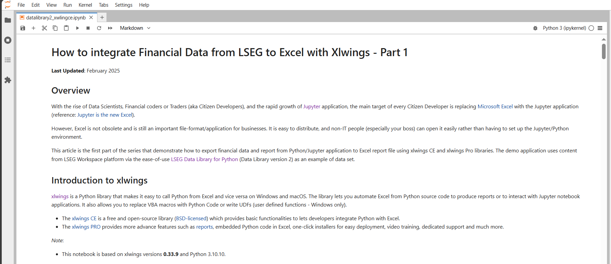

# How to integrate Financial Data from Delivery Library to Excel with Xlwings
- version: 2.0
- Last update: February 2025
- Environment: Windows
- Prerequisite: [Access to Workspace Desktop](#prerequisite) and [xlwings](https://www.xlwings.org)

Example Code Disclaimer:
ALL EXAMPLE CODE IS PROVIDED ON AN “AS IS” AND “AS AVAILABLE” BASIS FOR ILLUSTRATIVE PURPOSES ONLY. REFINITIV MAKES NO REPRESENTATIONS OR WARRANTIES OF ANY KIND, EXPRESS OR IMPLIED, AS TO THE OPERATION OF THE EXAMPLE CODE, OR THE INFORMATION, CONTENT, OR MATERIALS USED IN CONNECTION WITH THE EXAMPLE CODE. YOU EXPRESSLY AGREE THAT YOUR USE OF THE EXAMPLE CODE IS AT YOUR SOLE RISK.

## <a id="overview"></a>Overview

**Update February 2025**: There is a new and improve [LSEG Data Library for Python](https://developers.lseg.com/en/api-catalog/lseg-data-platform/lseg-data-library-for-python) (Data Library version 2) available now. Please find more detail on [Essential Guide to the Data Libraries - Generations of Python library (EDAPI, RDP, RD, LD)](https://developers.lseg.com/en/article-catalog/article/essential-guide-to-the-data-libraries) article.

With the rise of Data Scientist, Financial coder or, Trader (aka Citizen Developers) and rapid growth of [Jupyter](https://jupyter.org/) application, the main target of every Citizen Developers are replacing [Microsoft Excel](https://www.microsoft.com/en-us/microsoft-365/excel) with Jupyter application (reference: [Jupyter is the new Excel](https://towardsdatascience.com/jupyter-is-the-new-excel-a7a22f2fc13a)). 

However, Excel is not obsolete and still be an important file format/application in the business. It is easy to distribute and non-IT people (especially your boss) can open it easily than setup Jupyter/Python environment. 

This example project contains a series of Jupyter Notebook and Python console applications that demonstrate how to export financial data and report from Python/Jupyter application to Excel report file using xlwings CE and xlwings PRO libraries. The demo application uses content from [Delivery Platform (RDP)](https://developers.lseg.com/en/api-catalog/refinitiv-data-platform/refinitiv-data-platform-apis) (formerly known as Refinitiv Data Platform) via the ease-of-use [Data Library for Python](https://developers.lseg.com/en/api-catalog/refinitiv-data-platform/refinitiv-data-library-for-python) as an example of data set.


## <a id="xlwings"></a>Introduction to xlwings

[xlwings](https://www.xlwings.org) is a Python library that makes it easy to call Python from Excel and vice versa on Windows and macOS. The library lets you automate Excel from Python source code to produce reports or to interact with Jupyter notebook applications. It also allows you to replace VBA macros with Python Code or write UDFs (user defined functions - Windows only).
* The [xlwings CE](https://docs.xlwings.org/en/stable) is a free and open-source library ([BSD-licensed](https://opensource.org/licenses/BSD-3-Clause)) which provides basic functionalities to lets developers integrate Python with Excel. 
* The [xlwings PRO](https://www.xlwings.org/pricing) provides more advance features such as [reports](https://www.xlwings.org/reporting), embedded Python code in Excel, one-click installers for easy deployment, video training, dedicated support and much more. 

Please refer to [Financial Reporting with Workspace, xlwings and Excel](https://developers.lseg.com/en/article-catalog/article/financial-reporting-with-eikon-and-excel) article which give detail regarding how to integrate xlwings with other LSEG Python API.

*Note*:
This project is based on xlwings versions **0.30.12**.

## <a id="rdp_lib"></a>Introduction to the Data Library for Python

**Update February 2025**: There is a new and improve [LSEG Data Library for Python](https://developers.lseg.com/en/api-catalog/lseg-data-platform/lseg-data-library-for-python) (Data Library version 2) available now. Please find more detail on [Essential Guide to the Data Libraries - Generations of Python library (EDAPI, RDP, RD, LD)](https://developers.lseg.com/en/article-catalog/article/essential-guide-to-the-data-libraries) article.

The Data Library for Python provides a set of ease-of-use interfaces offering coders uniform access to the breadth and depth of financial data and services available on the RDP Platform. The API is designed to provide consistent access through multiple access channels and target both Professional Developers and Financial Coders. Developers can choose to access content from the desktop, through their deployed streaming services, or directly to the cloud. With the Data Library, the same Python code can be used to retrieve data regardless of which access point you choose to connect to the platform.

 

The RDP Library are available in the following programming languages:
- [Python](https://developers.lseg.com/en/api-catalog/refinitiv-data-platform/refinitiv-data-library-for-python)
- [TypeScript/JavaScript](https://developers.lseg.com/en/api-catalog/refinitiv-data-platform/refinitiv-data-library-for-typescript)
- [.NET](https://developers.lseg.com/en/api-catalog/refinitiv-data-platform/refinitiv-data-library-for--net)

For more deep detail regarding the RDP Libraries, please refer to the following articles and tutorials:
- [Quickstart](https://developers.lseg.com/en/api-catalog/refinitiv-data-platform/refinitiv-data-library-for-python/quick-start).
- [Documentation](https://developers.lseg.com/en/api-catalog/refinitiv-data-platform/refinitiv-data-library-for-python/documentation).
- [Tutorials](https://developers.lseg.com/en/api-catalog/refinitiv-data-platform/refinitiv-data-library-for-python/tutorials).
- [GitHub](https://github.com/LSEG-API-Samples/Example.DataLibrary.Python).

### Disclaimer

This project is based on RD Library Python versions **1.5.0** using the Desktop Session only.

## <a id="prerequisite"></a>Prerequisite
This demo project requires the following dependencies software.
1. Workspace access credential.
2. [xlwings library](https://www.xlwings.org/) version 0.30.x and above.
3. [Microsoft Excel](https://www.microsoft.com/en-us/microsoft-365/excel).
4. Python [Anaconda](https://www.anaconda.com/distribution/) or [MiniConda](https://docs.conda.io/en/latest/miniconda.html) distribution/package manager.
5. [Jupyter Lab](https://jupyter.org/).
6. Internet connection.

Please contact your LSEG's representative to help you to access LSEG Workspace credentials. You can generate/manage the AppKey by follow the steps on "Desktop - Eikon or Refinitiv Workspace" section of [RD Library - Python Quickstart page](https://developers.lseg.com/en/api-catalog/refinitiv-data-platform/refinitiv-data-library-for-python/quick-start).

## <a id="running"></a>Running the xlwings CE Notebook example.
1. Open Anaconda Prompt and go to project's folder
2. Run the following command in a Anaconda Prompt to create Conda environment named *xlwings* for the project.
    ```
    (base) $>conda create --name xlwings python=3.0
    ```
3. Once the environment is created, activate Conda environment named ```xlwings``` with this command in Anaconda Prompt
    ```
    (base) $>conda activate xlwings
    ```
4. Run the following command to install RDP Library for Python, xlwings CE and all dependencies in *xlwings* environment
    ```
    (xlwings) $>pip install -r xlwingsce_requirements.txt
    ```
5. Go to project's notebook folder and input your Workspace App Key a file name ```refinitiv-data.config.json``` with the following content
    ```json
    {
        "logs": {...},
        "sessions": {
            "default": "desktop.workspace",
            "desktop": {
                "workspace": {
                    "app-key": "YOUR APP KEY GOES HERE!"
                }
            }
        }
    }
    ```

6. In the current Anaconda Prompt, go to project's notebook folder. Run the following command to start classic Jupyter Notebook in the notebook folder.
    ```
    (xlwings) $>notebook>jupyter notebook
    ```
7. Jupyter Notebook will open the web browser and open the notebook home page.
8. Open *datalibrary_xwlingce.ipynb* Notebook document, then follow through each notebook cell.

     

## <a id="running_pro"></a>Running the xlwings PRO Notebook example.
1. Open Anaconda Prompt and go to project's folder
2. Run the following command in a Anaconda Prompt to create Conda environment named *xlwings_rdp* for the project.
    ```
    (base) $>conda create --name xlwingspro python=3.10
    ```
3. Once the environment is created, activate Conda environment named ```xlwingspro``` with this command in Anaconda Prompt
    ```
    (base) $>conda activate xlwingspro
    ```
4. Run the following command to install RDP Library for Python, xlwings CE and all dependencies in *xlwings_rdp* environment
    ```
    (xlwingspro) $>pip install -r xlwingspro_requirements.txt
    ```
5. Follow the same steps as [Running the xlwings CE Notebook example](#running) to open Jupyter Notebook in the web browser.
6. Open *part2_datalibrary_xlwingspro.ipynb* Notebook document, then follow through each notebook cell.

     

## <a id="conclusion"></a>Conclusion and Next Step

The xlwings CE library lets Python developers integrate data with Excel in a simple way. The xlwings PRO allows Python developers and business users to work together to integrate data with Excel or PDF report file in much easier than xlwings CE.

The xlwings Reports help businesses and financial teams design the report to match their business requirement freely. The Python developers/data engineers can focus on how to retrieve and optimize data without no need to worry about report design, look & feel. xlwings Reports also help developers can automate report generator process periodicity (such as a daily, weekly, or monthly report).

If users want dynamic data and charts in the report file, the xlwings Embedded Code feature lets users run Python code in the macro-enabled Excel report directly. Users do not need to run a separate Python code themselves or wait for Developers to generate a report file for them.

The newly introduced ```to_pdf``` feature also lets developers export the Excel Workbook/Sheets to the PDF file. This function helps business users who do not have [Microsoft Office](https://www.office.com/) installed can still be able to open the PDF report file.


At the same time, the [Data Library for Python](https://developers.lseg.com/en/api-catalog/refinitiv-data-platform/refinitiv-data-library-for-python) let developers rapidly access the Data Platform content with a few lines of code that easy to understand and maintain. Developers can focus on implement the business logic or analysis data without worry about the connection, authentication detail with the Platforms.

The integration between LSEG APIs and xlwings is not limited to only the Data Library. Any [LSEG APIs](https://developers.lseg.com/en/api-catalog) that support Python programming language such as [Data API](https://developers.lseg.com/en/api-catalog/eikon/eikon-data-api) ([Data API-xlwings article](https://developers.lseg.com/en/article-catalog/article/financial-reporting-with-eikon-and-excel)), or [RKD API](https://developers.lseg.com/en/api-catalog/refinitiv-knowledge-direct/refinitiv-knowledge-direct-api-rkd-api), or [DataStream Web Service - Python](https://developers.lseg.com/en/api-catalog/eikon/datastream-web-service/) can work with xlwings library using the same concept and code logic as this Data Library notebook examples.

<!-- ACKNOWLEDGEMENTS -->
## <a id="acknowledgements"></a>Acknowledgements

Thank you [Felix Zumstein (@fzumstein)](https://github.com/fzumstein) from [xlwings](https://www.xlwings.org/) for your contribution, code and content review and your support.

## <a id="references"></a>References

You can find more details regarding the Data Library for Python, xlwings and, related technologies for this notebook from the following resources:
* [Data Library for Python](https://developers.lseg.com/en/api-catalog/refinitiv-data-platform/refinitiv-data-library-for-python) on the [LSEG Developer Community](https://developers.lseg.com/) web site.
* [Xlwings web site](https://www.xlwings.org/).
* [Xlwings CE Document page](https://docs.xlwings.org/en/stable/).
* [xlwings Pro page](https://www.xlwings.org/pricing).
* [xlwings API Reference page](https://docs.xlwings.org/en/latest/api).
* [xlwings Reports page](https://www.xlwings.org/reporting).
* [xlwings Embedded Code page](https://docs.xlwings.org/en/stable/deployment.html#embedded-code).
* [Financial Reporting with Eikon, xlwings and Excel](https://developers.lseg.com/en/article-catalog/article/financial-reporting-with-eikon-and-excel).


For any questions related to this article or Data Library, please use the Developers Community [Q&A Forum](https://community.developers.refinitiv.com/).
